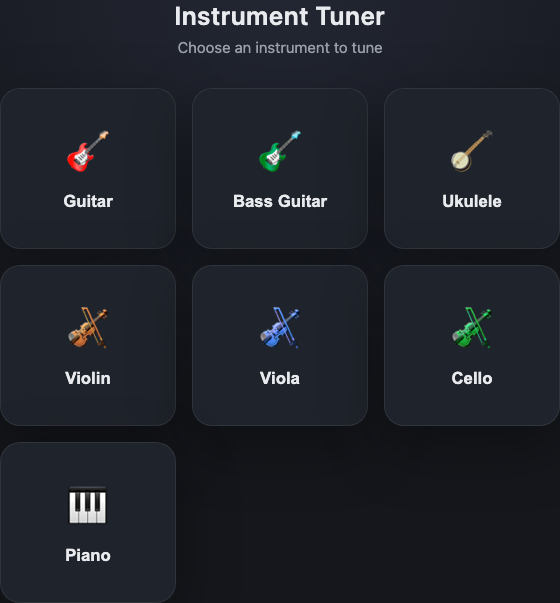
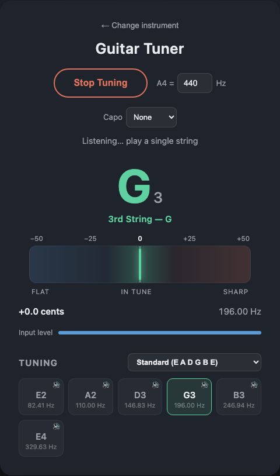
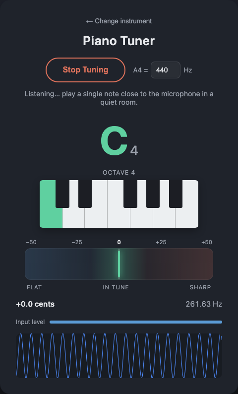

# Instrument Tuner

A browser-based tuner for guitar, bass guitar, ukulele, violin, viola, cello,
and piano, using the Web Audio API and the **YIN pitch detection algorithm**
(de Cheveigné & Kawahara, 2002) with parabolic interpolation for sub-cent
accuracy. Pick an instrument on the landing screen, then tune by ear against
the live meter.

No dependencies, no build step — just static HTML/CSS/JS. Installable as a
PWA and works offline after the first visit.

**[▶ Try it live](https://kevin-enyuan-li.github.io/instrument-tuner/)** — runs immediately in your browser, no download needed.

<p align="center">
  
</p>

<p align="center">
  
  
</p>

## Running it

Microphone access requires a "secure context" — `https://` or `localhost`.
Opening `index.html` directly via `file://` will not work in most browsers,
so serve it locally:

```sh
cd instrument-tuner
python3 -m http.server 8000
```

Then open http://localhost:8000, choose an instrument, click **Start
Tuning**, and allow microphone access. Your last-used instrument, tuning,
A4 reference, and capo setting are remembered for next time.

## Features

- **Seven instruments**: Guitar, Bass Guitar, Ukulele, Violin, Viola, Cello,
  Piano — each with its own frequency range and detection tuning (see below).
- **Alternate tunings**: Guitar has Standard, Drop D, Half Step Down, Open G,
  Open D, and DADGAD presets; Bass has 4-string and 5-string Standard;
  Ukulele has Standard (reentrant High G), Low G, and Baritone; Violin,
  Viola, and Cello each have their standard fifths tuning. A **Custom…**
  option lets you set any note/octave per string on any of them.
- **Capo support**: a capo-fret selector shifts every reference pitch up by
  the right number of semitones, so the tuner still reads "in tune"
  correctly with a capo on.
- **Reference tone playback**: a speaker icon on each string chip plays that
  string's target pitch, so you can tune by ear as well as by eye.
- **Adjustable A4**: 415–466 Hz, for matching an orchestra or recording.
- **Chromatic fallback**: if a detected pitch doesn't match any string in
  the current tuning, it still shows the raw note name/cents and says
  "Not part of this tuning" instead of going silent.
- **Piano keyboard graphic**: since piano has no fixed set of strings to
  show as chips, a single-octave keyboard (white + black keys) highlights
  the detected key directly, with an octave label that updates as you move
  around the piano.
- **Wake lock**: keeps the screen from sleeping while actively listening.
- **Installable / offline**: a manifest + service worker let you add it to
  your home screen and use it without a network connection.

## How it works

- **Capture**: `getUserMedia` grabs raw mic audio; an `AnalyserNode`
  (`fftSize = 4096`) exposes ~93ms windows of time-domain samples.
- **Pitch detection**: [`pitchDetector.js`](js/pitchDetector.js) implements
  YIN (difference function + cumulative mean normalized difference, refined
  with parabolic interpolation) for sub-cent frequency precision, returning
  both a frequency and a clarity score (confidence). See
  [docs/YIN-Pitch-Detection-Algorithm.md](docs/YIN-Pitch-Detection-Algorithm.md)
  for a full walkthrough of how it works, and
  [docs/Pitch-Detection-Debugging-Log.md](docs/Pitch-Detection-Debugging-Log.md)
  for the detailed history of real-world failure modes encountered and how
  each was fixed (including one left honestly unresolved).
- **Per-instrument config**: [`instruments.js`](js/instruments.js) defines the
  frequency search range, YIN threshold, clarity gate, smoothing window, and
  tunings for each instrument:
  - **Guitar** — narrow range (60–400 Hz) covering standard-tuned strings
    only, so the search can't lock onto a string's own harmonic instead of
    its fundamental (a common octave-error failure mode, especially on the
    high E string).
  - **Bass Guitar** — narrower still (27–140 Hz), with the same anti-octave-
    error reasoning applied to the bass's own range (capped below the
    highest string's 2nd harmonic).
  - **Ukulele** — 130–500 Hz, covering everything from Baritone's low D3 up
    to standard tuning's A4, again capped below the highest string's own
    2nd harmonic.
  - **Violin** — 170–750 Hz, covering G3–E5, capped below the E string's
    2nd harmonic (1318.52 Hz).
  - **Viola** — 115–500 Hz, covering C3–A4, capped below the A string's
    2nd harmonic (880 Hz).
  - **Cello** — 63–260 Hz, covering C2–A3, capped below the A string's 2nd
    harmonic (440 Hz). The floor here is a tighter squeeze than any other
    instrument: cello's open C string (65.41 Hz) sits close enough to 50/60
    Hz mains hum that catching a *very* flat C string trades off against
    keeping hum structurally excluded from the search range — the floor is
    kept just above 60 Hz specifically, since that's what prevents hum from
    ever being mistaken for a real note in the first place, rather than
    relying on the boundary-artifact guard alone.
  - **Piano** — full range (25–4500 Hz) covering A0–C8; no fixed tuning
    list, since any of the 88 keys is valid.
- **Reference-note matching**: each tuning's target frequencies are stored
  relative to A4=440; a single `effectiveFreq()` helper scales them by both
  the current A4 setting and the capo's semitone ratio, so chip labels,
  closest-string matching, and tone playback all stay consistent.
- **String labels adapt to reentrant tunings**: "Low X"/"High X" chip labels
  assume pitch rises monotonically from the highest string number down to 1.
  Standard ukulele tuning is *reentrant* (its G string is pitched above the
  adjacent C string), which `isLinearTuning()` detects, falling back to
  plain note names for that tuning rather than showing a misleading label.
- **Noise robustness**: a cascaded high-pass filter (matched to each
  instrument's frequency floor) removes sub-range hum/rumble before
  analysis, and detections landing suspiciously close to the exact frequency
  floor are rejected outright — a search-range "clamping" artifact that can
  otherwise read as a confident (but false) low note when a quiet string is
  picked up alongside low-frequency ambient noise.
- **Octave-down correction**: YIN can occasionally settle on double the true
  period (half the true frequency) instead of the fundamental — most visible
  on a string with a weak fundamental relative to its harmonics, flickering
  between the real note and its octave-down neighbor. Rather than changing
  detector behavior generally (which risks misreading a genuinely lower
  string as its own 2nd harmonic), the correction is applied at the matching
  level: if doubling a poorly-matching reading suddenly lands it almost
  exactly on one of the current tuning's real targets, that's treated as
  strong evidence of this specific error and corrected before smoothing.
- **Clarity gradient**: some instruments' fundamentals get progressively
  weaker and more inharmonic toward the top of their range — most
  pronounced for piano, where string stiffness is a *gradual* effect across
  the whole upper register rather than a sharp transition at any one note.
  Piano's confidence bar relaxes smoothly from 0.7 at 1000 Hz down to 0.35
  at 4500 Hz (`clarityGradient` in `instruments.js`) instead of a hard
  cutoff, which left real gaps just below wherever the cutoff was placed.
  High-frequency false positives from real-world noise are inherently rare,
  so this is safe to push far — verified against broadband noise across
  the full gradient.
- **Note mapping**: detected frequency is converted to the nearest 12-tone
  equal-temperament note relative to the configured A4, with deviation
  reported in cents (`1200 · log2(f / f_note)`).
- **Display**: a center-zeroed needle meter shows flat/sharp deviation
  (green within ±5 cents, amber within ±15, red beyond), plus live frequency
  and note name.
- **Smoothing & gating**: a median filter over recent pitch estimates damps
  jitter without adding much lag; estimates are only accepted above a
  clarity threshold, and an RMS silence check skips the pitch search
  entirely (and clears the display after a short hold) when there's no
  signal.

## Known scope limits

- **12-string guitar** isn't modeled as a separate preset — its paired
  courses (some an octave apart, some unison) don't fit the current
  "one target pitch per string" design cleanly. Standard 6-string tuning
  still works fine for tuning each physical string one at a time.